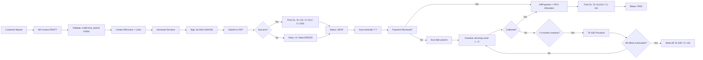
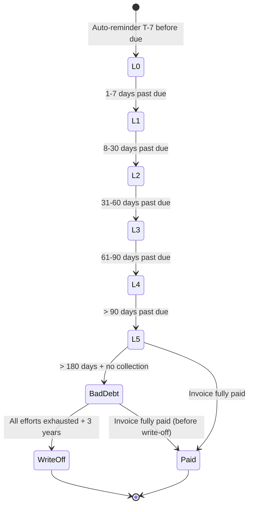

# AR Workflows & User Journeys
## SmartACCT ERP — Vietnamese AR Module

---

## W1. Invoice-to-Cash Workflow (End-to-End)



---

## W2. Dunning Escalation State Machine



**Notification Schedule per Level:**

| Level | Trigger | Method | Content | Actor |
|-------|---------|--------|---------|-------|
| L0 | 7 days before due | Email | "Invoice #XXX due on YYYY-MM-DD" | System |
| L1 | 1-7 days overdue | Email | "Payment overdue — please arrange within 7 days" | System |
| L2 | 8-30 days overdue | SMS + Phone | Collection call + SMS reminder | Collections Officer |
| L3 | 31-60 days overdue | Formal letter | Demand letter (printed + PDF) | Legal Dept |
| L4 | 61-90 days overdue | Legal notice | Formal collection notice (TN Lawyer template) | Legal Dept |
| L5 | > 90 days overdue | External engagement | Recommend external collector / litigation | CFO approval |

---

## W3. Monthly Closing AR Process

```
Phase 1: Pre-Close (Day 25–28)
├── Sales Accountant:
│   ├── Verify all AR Invoices are SENT (no DRAFT in closed period)
│   ├── Verify all payments for period are allocated
│   └── Flag exceptions: disputes, unapplied cash
├── Collections Officer:
│   ├── Run Dunning Queue — confirm all overdue addressed
│   └── Identify invoices for write-off (manager approval)
└── CFO:
    ├── Review outstanding AR aging
    ├── Decide write-offs for year-end (if applicable)
    └── Approve TK 630 provisions

Phase 2: System Snapshot (Day 28, after period close)
├── POST /ar/aging/snapshot?period=YYYY-MM [requires CLOSED period]
├── System locks snapshot; write ARAgingSnapshot rows
├── Compute KPIs: DSO, CEI, Bad Debt Ratio
└── Email PDF report to CFO + Controller

Phase 3: Post-Close (Day 1–3 of next month)
├── Controller:
│   ├── Verify snapshot totals match GL accounts (TK 131 balance)
│   └── Sign off AR reconciliation
└── System:
    ├── Archive open AR Invoice list (backup)
    └── Reset dunning_level counters for new month
```

---

## W4. AP & AR Netting Workflow (Cross-Module)

```
Prerequisites: AP module operational; Customer exists in both AR (as debtor) and AP (as creditor)

1. CFO → POST /ar/netting { customer_id, notes }
2. System queries:
   - AR: sum(balance_due) for customer where balance_due > 0
   - AP: sum(balance_due) for customer where balance_due > 0
3. Compute net = AR - AP
4. Cases:
   a) net > 0: Customer pays net → allocate to AR invoices + reduce AP
   b) net < 0: Company refunds net → allocate to AP invoices + reduce AR
   c) net == 0: Full netting; no cash movement; offset entries only
5. For each offset:
   - Create ARDunningLog + AP payment log
   - Post GL: Dr 331 (for AP reduction) / Cr 131 (for AR reduction)
6. Return settlement confirmation
```

---

## W5. User Journey: Sales Accountant — Daily Routine

**Persona:** Nguyễn Thị Mai, Sales Accountant, 3 years experience  
**Workload:** 15–25 invoices/day, 50–100 customers  

```
[TIME]    [ACTION]                                    [SYSTEM]
06:30     Check emails                                Outlook
07:00     Login SmartACCT                              JWT auth → Dashboard
07:05     Run AR Aging Report (today's view)           GET /ar/aging
          → Review: 3 invoices overdue D1
07:10     Send Dunning L1 (auto-scheduled via cron)    System runs 08:00 job
          → Manual review: "Công ty ABC" disputes invoice
07:15     Log dispute note                            PATCH /ar/invoices/45 { notes: "Customer disputes qty, awaiting resolution" }
07:20     Create new customer: "Công ty XYZ"          POST /ar/customers
          → Validate tax_code "0123456789" → OK
          → credit_limit 500m, terms NET30 → saved
07:25     Create AR Invoice #2026-0601-001            POST /ar/invoices
          → Select Công ty XYZ
          → Add 5 line items (Products A-E)
          → Subtotal: 250m + VAT 10% = 275m
          → Check credit: 250m ≤ 500m ✓
          → Submit → auto-post to GDT
          → GDT returns verification_code "ABC123..."
          → GL posted: Dr 131(275m) / Cr 511(250m) / Cr 3331(25m)
          → Email sent to customer with e-invoice attachment
07:35     Review Dunning Queue                         GET /ar/dunning/queue
          → 5 L2 items: call + SMS sent by cron
          → 2 L3 items: generate demand letters
07:45     Update AR Invoice status (dispute resolved)  PATCH /ar/invoices/45 { status: "SENT" }
08:00     End of daily AR tasks → move to GL/GL entries
```

---

## W6. User Journey: Collections Officer — Weekly Cycle

**Persona:** Trần Văn Hùng, Collections Officer, 5 years experience  
**Team:** 3 collectors covering 400 active customers  

```
[DAY]     [ACTION]                                    [SYSTEM]
Monday    08:30  Weekly planning                       Review Dunning Queue report
          09:00  D3/L3 letters from Friday → print      GET /ar/dunning?level=3
          10:00 Phone calls for L2 (8-30 days)        Manual + log ARDunningLog
          14:00 Escalate D3 to Legal                   Email Legal Dept + flag in system
Tuesday   09:00 Visit top 3 overdue customers         Field visits (outside system)
          15:00 Log collection outcomes               PATCH ARDunningLog { outcome, next_date }
Wednesday 09:00 Review L4/L5 (61-90+, > 90 days)     GET /ar/dunning?level=4,5
                    → Recommend write-off for 2 customers → CFO notification
          14:00 Reconcile AR ledger with GL           Verify TK 131 matches AR total
Thursday  09:00 Follow up on last week's payments    GET /ar/payments?date_range=last7d
                    → Verify allocations correct
          15:00 Update customer credit ratings        PUT /ar/customers/{id} { credit_rating }
Friday    09:00 Weekly report for CFO                 GET /ar/reports/collection-effectiveness
                    → CEI calculation, DSO by customer
          14:00 Prepare write-off pack                Compile: invoices, dunning logs, legal letters
          16:00 Submit to CFO for approval             POST /ar/bad-debt/write-off-request
```

---

## W7. User Journey: CFO — Month-End Close

**Persona:** Lê Thị Hương, CFO, 15 years experience  
**Responsibilities:** AR oversight, provision approval, BCTC sign-off  

```
[DAY]     [ACTION]                                    [SYSTEM]
Day 25    Pre-close warning notification              System sends "Period closing in 5 days" alert
          16:00 Review AR Aging forecast              GET /ar/aging (preview for period close)

Day 28    GL Period Close Day
          09:00 Pre-close checklist                   Run custom checklist:
                    □ All AR invoices posted
                    □ All payments allocated
                    □ No DRAFT invoices in period
                    □ Aging snapshot generated? NO yet → must wait
          14:00 Approve period close                  POST /gl/periods/{period}/close
          14:30 System auto-triggers aging snapshot    POST /ar/aging/snapshot?period=YYYY-MM
                    → Verify: snapshot locked, totals match GL TK 131
          15:00 Review CEI + DSO                      GET /ar/reports/collection-effectiveness
                    → CEI 87% (target 90%) → flag collections team
                    → DSO 42 days (target 35) → action item
          16:00 Approve TK 630 provisions              Review POST /ar/bad-debt/provisions
                    → Approve provision for "Công ty DEF" 150m VND
                    → Approve write-off for "Công ty GHI" 45m VND
          17:00 Sign BCTC AR disclosure block           IFRS 7 disclosure ready
                    → Export PDF + XBRL
```

---

## W8. Exception Handling — Dispute Resolution Workflow

```
┌────────────────────────────────────────────────────────────┐
│ SCENARIO: Customer disputes invoice amount/quality/delivery│
└────────────────────────────────────────────────────────────┘

1. Collections Officer receives dispute email
2. Collections → PATCH /ar/invoices/{id}
   { status: "DISPUTED", dispute_reason: "...", dispute_date: "..." }
3. System:
   - Logs dispute in ARDunningLog
   - Temporarily freezes dunning escalation for this invoice
   - Creates internal task for Sales Accountant
4. Sales Accountant → investigation (outside AR system)
5. Resolution outcomes:
   a) Invoice correct → Dispute REJECTED
      - System → PATCH status back to SENT
      - Resume dunning from current level
   b) Partial credit → Issue credit note (EInvoice adjustment)
      - System → POST /tax/invoices/{id}/adjustment { amount, reason }
      - ARInvoice adjusted: grand_total -= credit_amount
      - If balance_due = 0: status → PAID (refund if overpaid)
   c) Full reversal → VOID invoice
      - System → PATCH status = VOID
      - Post GL: reverse entries (Cr 131 / Dr 511 / Dr 3331)
      - Not permitted if GDT already submitted → requires tax correction instead
6. Collections updates ARDunningLog with resolution
7. If resolution > 30 days: auto-escalate to manager
```

---

## W9. User Journey: System Administrator — AR Configuration

**Persona:** Phạm Văn Tùng, System Administrator  
**Frequency:** Onboarding + quarterly review  

```
[WEEK]   [ACTION]
Week 1   AR module deployment:
         ├── Create DB tables via Alembic migration
         ├── Configure rate limits (Limiter):
         │   ├── /ar/customers: 100/hour
         │   ├── /ar/invoices: 200/hour
         │   └── /ar/dunning: 50/hour (admin)
         ├── Configure APScheduler jobs:
         │   ├── daily-dunning: 08:00 VN time
         │   ├── monthly-aging-snapshot: 1st of month 00:01
         │   └── gdt-retry: every 4 hours for ERROR invoices
         └── Configure email templates (i18n: vi/en):
             ├── pre-due reminder (L0)
             ├── dunning L1/L2/L3/L4/L5
             ├── write-off approval request
             └── monthly KPI report

Quarterly:
         ├── Review rate limits (adjust for peak periods)
         ├── Update e-invoice schemas (GDT API version changes)
         ├── Verify signing certificate validity
         └── Audit dunning effectiveness: L1→L5 conversion rates
```

---

## W10. Regulatory Compliance Workflow (NĐ70/2025)

```
Annual Compliance Checklist (System-Assisted):

1. [JAN] E-invoice threshold review
   - If revenue > 1bn VND/year: confirm POS compliance
   - Verify all invoices use NĐ70 format (system validates on create)

2. [MONTHLY] GDT submission audit
   - Query: EInvoice where status = SENT AND verification_code IS NULL
   - Flag for manual resubmission
   - Verify signed_file_url reachable (GDT CDN validity)

3. [QUARTERLY] TK 630 provision review
   - Run aging report
   - Verify provision rates per Circular 200/2014
   - CFO signs provision memo

4. [ANNUAL] BCTC AR disclosure
   - Generate aging snapshot (period-locked)
   - Compute ECL (IFRS 9) + TK 630 (VAS)
   - Produce disclosure notes per VAS + IFRS 7 requirements
   - External audit verification (VACPA-registered auditor)

5. [ON-DEMAND] GDT data mining response
   - If GDT requests AR data, export via:
     GET /ar/export?format=csv&period=YYYY-MM&customer_id=xxx
   - Include: invoice_number, issue_date, buyer_tax_code, amount, vat, status
```

---

## Process Definitions (Cross-Functional)

### PROC-AR-01: Customer Onboarding
```
Responsible: Sales Accountant
Steps: 1. Collect business registration, tax certificate → validate
       2. Create Customer in SmartACCT
       3. Set initial credit limit (per CFO approval if > 100m VND)
       4. Configure dunning template per customer language
       5. Send welcome email with payment terms
       6. Add to AR aging report default view
Duration: 1–2 business days
SLA: Customer must be created before first invoice can be issued
```

### PROC-AR-02: Payment Reconciliation
```
Responsible: Collections Officer + GL Accountant
Steps: 1. Receive bank notification of payment
       2. Create ARPayment in SmartACCT
       3. Auto-allocate to open invoices (FIFO) OR manual allocation
       4. Verify GL TK 111 matches bank statement
       5. Send payment receipt to customer
       6. Update customer.outstanding_balance
Duration: Same day as bank receipt
SLA: Payment must be allocated within 24 hours of receipt
```

### PROC-AR-03: Write-Off Approval
```
Responsible: Collections Officer (initiate) + CFO (approve)
Steps: 1. Confirm all dunning levels exhausted (D1-D5)
       2. Gather evidence: dunning logs, legal letters, bankruptcy notice
       3. CFO review + sign write-off memo
       4. Execute write-off in SmartACCT
       5. Update BCTC notes
       6. Notify tax auditor (if material amount > 100m VND)
Duration: 5–10 business days
SLA: Write-off must be approved before year-end BCTC
```

---

## Data Flow Summary

```
LEGEND:
  [Actor]          Human or external system
  [System]         SmartACCT internal
  ─────────────    External boundary
  ═════════════    Internal boundary
  [DB]             PostgreSQL writes
  [API]            HTTP endpoint

FLOW: Invoice Creation
  [Sales Acct] ──POST──► [API: /ar/invoices]
      │
      ▼
  [System] validate: customer, credit, period
      │
      ▼
  [System] create ARInvoice + ARInvoiceLines ──► [DB: ar_invoice, ar_invoice_line]
      │
      ▼
  [System] generate EInvoice ──────────────────► [DB: einvoice]
      │
      ▼
  [System] sign via RSA-SHA256 ────────────────► [services/signing_service]
      │
      ▼
  [System] submit to GDT ──────────────────────► [thuedientu.gdt.gov.vn]
      │                         ◄──────────────── verification_code + signed_file_url
      │
      ▼
  [System] post GL ────────────────────────────► [DB: journal_entry, journal_entry_line]
      │
      ▼
  [Response] 201 { ar_invoice_id, status: "sent", einvoice: { verification_code } }


FLOW: Payment Receipt
  [Collections] ──POST──► [API: /ar/payments]
      │
      ▼
  [System] create ARPayment ───────────────────► [DB: ar_payment]
      │
      ▼
  [System] FIFO allocate to open invoices ─────► [DB: ar_payment_allocation]
      │                                     └──► [DB: ar_invoice (update balance_due)]
      │
      ▼
  [System] post GL per invoice ────────────────► [DB: journal_entry, journal_entry_line]
      │
      ▼
  [Response] 201 { ar_payment_id, allocations: [...], amount_unapplied }
```
